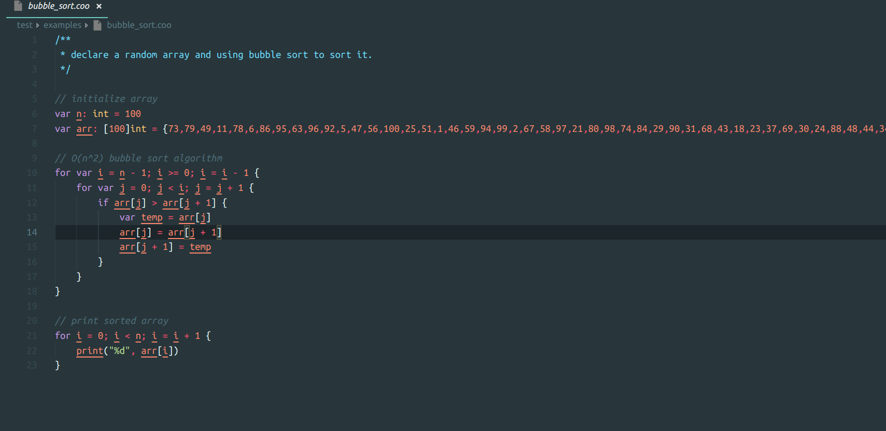

# coo-vscode README

coo-vscode is a vscode extension for supporting [coo-lang](https://github.com/coo-lang/coo).

## Screenshot

## Features

- Syntax highlight.

## Requirements

**No requirements**

## Extension Settings

**No setting**

## Known Issues

**No issus currently**

- support syntax highlight for coo-lang.